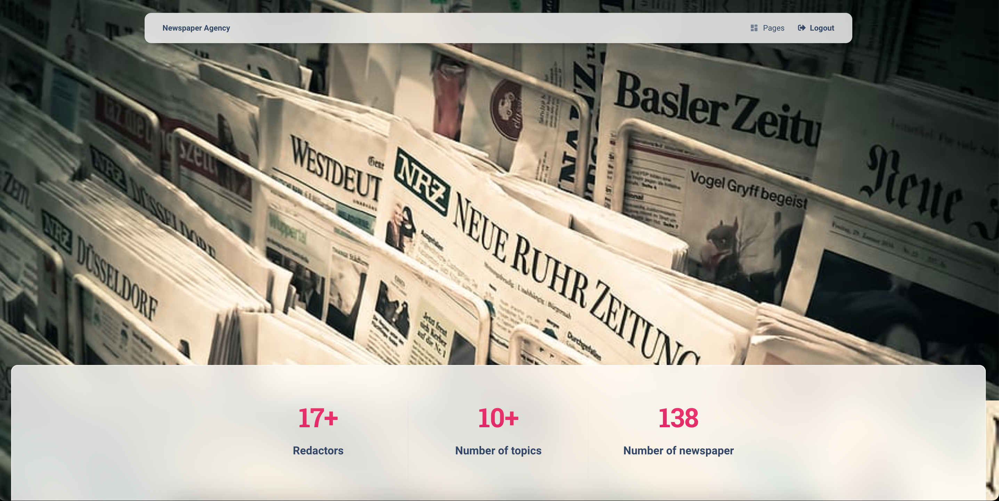

# Newspaper agency (NA) project

Django project for managing newspapers and authors in Agency

## Check it out!

[Newspaper agency project deployed to render](https://newspaper-agency-1mwc.onrender.com/) 

# newspaper-agency2

Python3 must be already installed

```shell
git clone https://github.com/asdadaversa/newspaper-agency2.git
cd newspaper-agency2
python3 -m venv venv
source venv/bin/activate
pip install -r requirements.txt
```
> Set Up Database
```bash
$ python manage.py makemigrations
$ python manage.py migrate
```

`python manage.py loaddata db_data.json`

```bash
$ python manage.py runserver
```

At this point, the app runs at `http://127.0.0.1:8000/`.




- After loading data from fixture you can use following superuser (or create another one by yourself):
  - Login: `admin`
  - Password: `Qwerty.1`
- 
